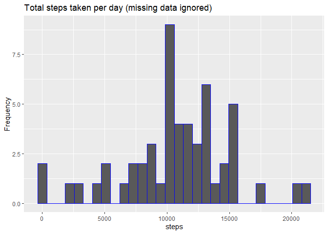
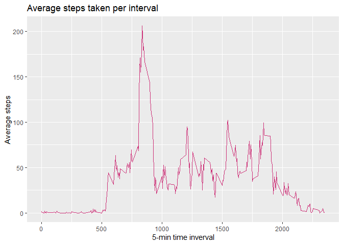
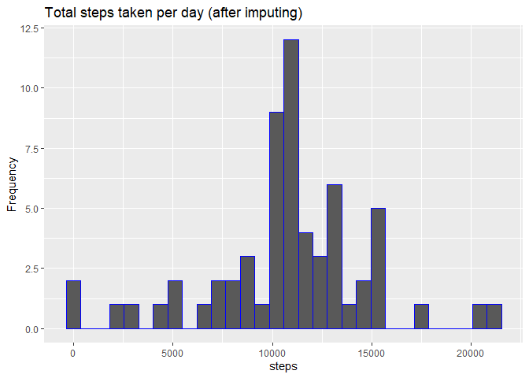
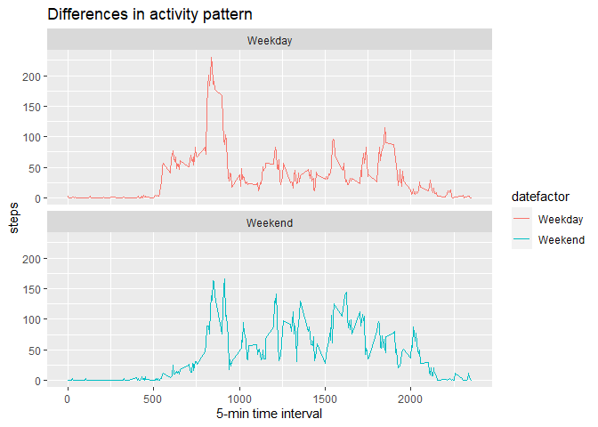

## Loading and preprocessing the data

First we need to read the data into R and see how the data is formatted


```r
activity <- read.csv("activity.csv")

head(activity)
```

```
##   steps       date interval
## 1    NA 2012-10-01        0
## 2    NA 2012-10-01        5
## 3    NA 2012-10-01       10
## 4    NA 2012-10-01       15
## 5    NA 2012-10-01       20
## 6    NA 2012-10-01       25
```

Since the dates are in a character format, we convert them to a usable format.


```r
activity$date <- as.Date(activity$date, format = "%Y-%m-%d")
```

## What is mean total number of steps taken per day?


```r
# Including the library required

library(ggplot2)

# Calculating the total steps per day

t_steps <- aggregate(steps ~ date, data = activity, sum, na.rm = TRUE)

# Making the plot 

ggplot(data = t_steps, aes(steps)) + geom_histogram(color = "blue") + 
  ggtitle("Total steps taken per day (missing data ignored)") + ylab("Frequency")
```

```
## `stat_bin()` using `bins = 30`. Pick better value with `binwidth`.
```

<!-- -->

Now we need to calculate the mean and median of total steps 


```r
mean(t_steps$steps)
```

```
## [1] 10766.19
```

```r
median(t_steps$steps)
```

```
## [1] 10765
```

## What is the average daily activity pattern?


```r
# Calculating the average steps per interval.

avg_steps <- aggregate(steps ~ interval, data = activity, mean, na.rm = TRUE)

# Plotting the graph

ggplot(avg_steps, aes(interval, steps)) + geom_line(col = "violetred3") + 
  ggtitle("Average steps taken per interval") + xlab("5-min time inverval") + 
  ylab("Average steps")
```

<!-- -->

Finding the interval which contains the maximum average steps.


```r
m_int <- which.max(avg_steps$steps)

avg_steps[m_int,]$interval
```

```
## [1] 835
```

## Imputing missing values

Calculating the total number of **NA** values.


```r
t_na <- is.na(activity$steps)

sum(t_na)
```

```
## [1] 2304
```

Now to impute the missing values.


```r
n_steps <- match(activity$interval, avg_steps$interval)

im_steps <- avg_steps$steps[n_steps]
```

Now we need to make a dataset similar to `actvity` which contains the imputed values


```r
activity2 <- transform(activity, 
                       steps = ifelse(is.na(activity$steps), 
                                      yes = im_steps, no = activity$steps))

# Calculating the aggregate of steps per day

t_steps2 <- aggregate(steps ~ date, data = activity2, sum)

# Plotting the graph

ggplot(t_steps2, aes(steps)) + geom_histogram(col = "blue") + 
  ggtitle("Total steps taken per day (after imputing)") + ylab("Frequency")
```

```
## `stat_bin()` using `bins = 30`. Pick better value with `binwidth`.
```

<!-- -->

```r
# Calculating the mean and median of the dataset

mean(t_steps2$steps)
```

```
## [1] 10766.19
```

```r
median(t_steps2$steps)
```

```
## [1] 10766.19
```

What we see here is that the median has shifted and became **equal** to the mean of the dataset. After imputing the data, we see the maximum frequency has also **shifted** a little bit to the right. 

## Are there differences in activity patterns between weekdays and weekends?

**NOTE: Performing the following manipulations on imputed data**


```r
activity2$datefactor <- sapply(activity2$date, function(x){
  if(weekdays(x) == "Sunday" | weekdays(x) == "Saturday"){
    y <- "Weekend"
  }
  else{
    y <- "Weekday"
  }
  y
})

# Calculating the total steps distinguished by weekend/weekday

tw_steps <- aggregate(steps ~ interval + datefactor, data = activity2, mean)
```

Now to make a comparision graph


```r
ggplot(tw_steps, aes(interval, steps, color = datefactor)) + 
  facet_wrap(. ~ datefactor, nrow = 2, ncol = 1) + geom_line() + 
  ggtitle("Differences in activity pattern") + xlab("5-min time interval")
```

<!-- -->
